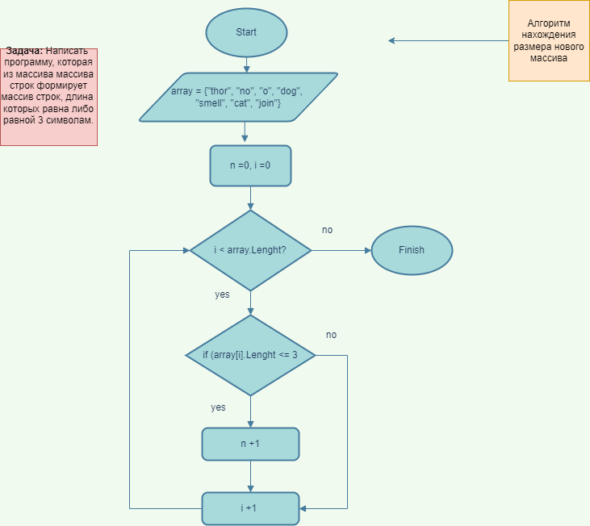
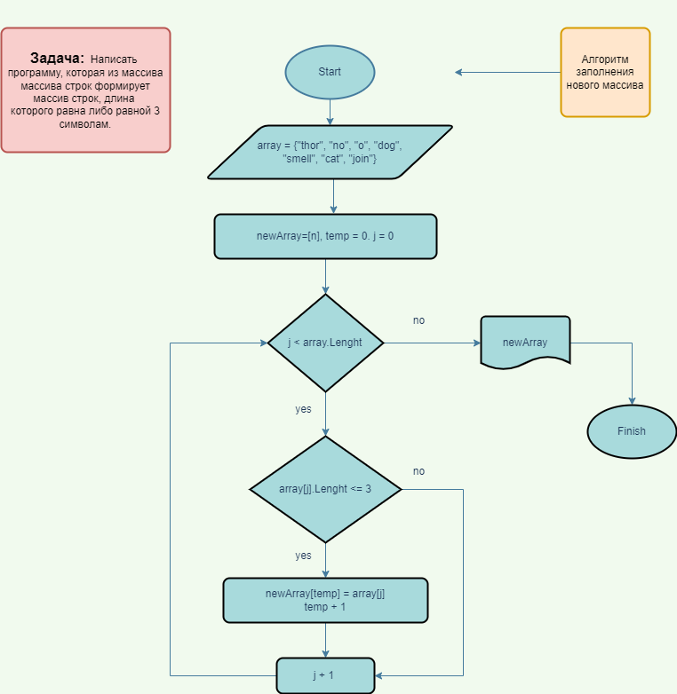

# Test_GeekBrains
Контрольная работа по итогу прохождения первого блока обучения по программе Разработчик.

## Задача

Написать программу, которая из имеющегося массива строк формирует массив строк, длинна которых меньше либо равна 3 символа.

## Решение

* Для начала создадим массив строк. Пусть его задаст пользователь.
* Создаём алгоритм, который определит сколько строк в массиве содержит не более 3 символов.
* Первый алгоритм: 

* После того как узнали размер нового массива создаём новый массив строк, согласно условию задачи. 
* Второй алгоритм:

* После заполнения массива, выводим его на экран.
